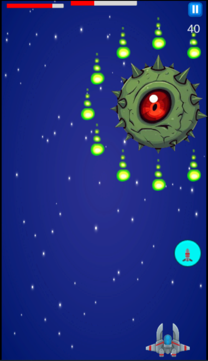

# Space Survivor

A 2D space shooter game developed in Unity, featuring enemy wave system, boss fights, and skill-based combat mechanics.

---

# Features
- Enemy wave spawning system with progression scaling
- Boss AI with movement patterns
- Player skill system (special attack)
- Object pooling for bullets and enemies (performance optimization)
- Score system with real-time UI updates
- Collision and damage system optimization

---

# Tech Stack
- Unity Engine
- C# scripting
- Object-Oriented Programming (OOP)
- Object Pooling pattern
- Singleton pattern
- Unity Physics 2D

---

# Gameplay
- Move spaceship and survive enemy waves
- Shoot normal bullets and special skills
- Defeat bosses for higher score

---

# Preview

---

# How to Run
1. Clone repository
2. Open project in Unity Hub
3. Open scene: `Menu`
4. Press Play

---

# Developer
- Name: Trung
- Role: Game Developer (Unity)
- GitHub: https://github.com/trunghhnd
- Itch: https://trunghhnd.itch.io/spacesurvivor
- Youtube: https://www.youtube.com/watch?v=X_t6U0rC4Lg
